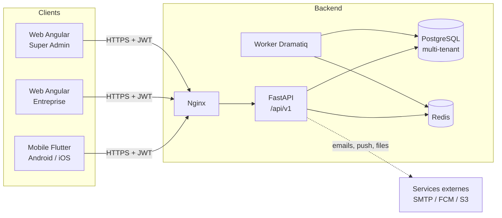
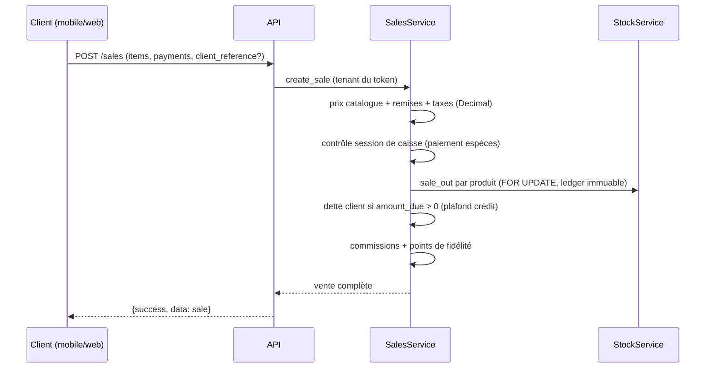

# Architecture — N'Zassa Business

## Vue d'ensemble

## Backend (apps/backend)

- **FastAPI asynchrone**, SQLAlchemy 2 async, PostgreSQL, Redis, Dramatiq.
- Découpage : `core/` (config, DB, sécurité, tenancy, pagination, audit,
  middleware, RBAC) et `modules/<domaine>/` (router + service + schemas).
- Réponses standardisées `{success, message, data, meta}` et codes d'erreur
  stables (packages/shared-contracts/error-codes.md).
- Toute la logique financière (totaux, taxes, remises, soldes, commissions,
  valorisation) est calculée côté backend en `Decimal`.

## Flux d'une vente

## Web (apps/web)

Angular 18 standalone + Signals, lazy routes, interceptors (JWT + refresh sur
401), guards (auth, permission, superadmin), PrimeNG + Tailwind.

## Mobile (apps/mobile)

Flutter, Riverpod, GoRouter, Dio. Offline-first : cache SQLite +
file `pending_operations` rejouée sur `/sync/push` (idempotence par UUID).

## Voir aussi

- [Stratégie multi-tenant](multi-tenancy.md)
- [Sécurité](security.md)
- [Modèle de données](../database/README.md)
- [Stratégie hors connexion](offline.md)
