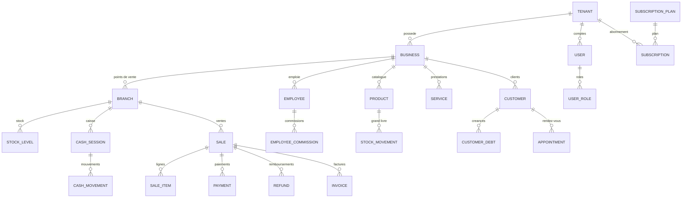

# Modèle de données

73 tables PostgreSQL, toutes générées par la migration Alembic initiale
(`apps/backend/migrations/versions`). Colonnes standard des entités métier :
`id` (UUID), `tenant_id`, `created_at`, `updated_at`, `created_by`,
`updated_by`, `deleted_at`, `version`.

## Domaines principaux



## Règles clés

- **Montants** : `NUMERIC(14,2)` ; quantités `NUMERIC(14,3)` ; taux `NUMERIC(7,4)`.
- **Unicité par tenant** : `(tenant_id, sku)`, `(tenant_id, barcode)`,
  `(tenant_id, number)` (ventes/BC/factures/avoirs), `(tenant_id, phone)` clients,
  `(tenant_id, client_reference)` (idempotence offline).
- **`stock_movements`** : append-only, quantité signée + `quantity_after`,
  référence vers l'origine (vente, commande, transfert, remboursement…).
- **`audit_logs`** : append-only, before/after JSONB, correlation_id.
- **`sync_operations`** : `(tenant_id, client_operation_id)` unique + résultat stocké.

## Index

Index sur toutes les FK chaudes + composites : `(branch_id, product_id)` sur les
mouvements, `(branch_id, status)` sur les ventes, `(employee_id, starts_at)` sur
les rendez-vous, `(employee_id, period_date)` sur les commissions,
`(tenant_id, entity_type, entity_id)` sur l'audit.

## Migrations

```bash
cd apps/backend
alembic upgrade head                  # appliquer
alembic revision --autogenerate -m "" # nouvelle migration
alembic downgrade -1                  # revenir en arrière
```
